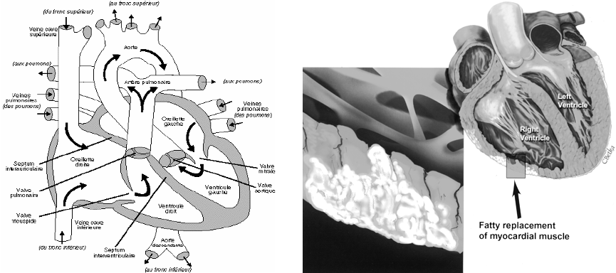

```{r setup, include=FALSE}
knitr::opts_chunk$set(echo = FALSE)
```



## General information 

Source of the article:  [link](https://news.fsu.edu/news/health-medicine/2021/02/17/fsu-college-of-medicine-researcher-develops-new-possibilities-to-prevent-sudden-cardiac-death/)

Date: 17/02/2021

Word count: 458

## Vocabulary 

| Word from the text             | Synonym/ Definition in English                                                 | French transation                       |
| ------------------------------ | ------------------------------------------------------------------------------ | --------------------------------------- |
| arrhythmogenic cardiomyopathy  | a disease in which heart muscle cells are gradually replaced by fat and fibrous tissue                                                              | la  cardiomyopathie arythmogène         |
| a scar                         | any mark left in the skin or other tissues following the healing of a wound    | cicatrice                               |
| behind                         | syn: rear                                                                      | derrière                                |
| a avenue                       | syn: a track                                                                   | piste                                   |
| issue                          | syn: issue number, publication number                                          | numéro                                  |
| to manage                      | syn: to cope, to perform                                                       | gérer, prise en charge, se débrouiller  |
| properly                       | syn: appropriately                                                             | correctement                            |
| extensive                      | syn: wide                                                                      | vaste                                   |
| worthwhile                     | sufficiently important, rewarding, or valuable to justify time or effort spent | utile                                   |
| inherited                      | syn: hereditary, genetic                                                       | héréditaire                             |
| processing                     | syn: transforming                                                              | transformation, (traitement)            |
| powerhouse                     | an electrical generating station or plant                                      | centrale électrique, puissance          |
| inability                      | syn: incapacity, incompetence                                                  | incapacité                              |
| to occur                       | syn: to happen, to turn up                                                     | survenir                                |
| to overwhelme                  | to overpower the thoughts, emotions, or senses of                              | surcharger, submerger                   |
| to unravel                     | syn: to untangle                                                               | révelern démêler                        |
| to mediate                     | syn: to arbitrate, to intervene                                                | servir de médiateur                     |
| to provide                     | to put at the disposal, syn: to offer                                          | fourninr                                |
| to prevent                     | syn: to avoid, to inhibit                                                      | éviter, prévenenir, empêcher            |

## Analysis about the study 
* Researchers :

Florida State University : Stephen Chelko, an assistant professor of biomedical sciences, has developed a better understanding of the pathological characteristics behind the disease.

* Published in? when:

 Science Translational Medicine. in the current issue of the store i.e. at the same time as it appeared on the site.

Florida state unversity news (17/02/2021)

* General topic:

This article talks about one of the main causes of sudden cardiac death. it is arrhythmogenic cardiomyopathy. It is a hereditary genetic disease in which healthy heart muscle is replaced by scar tissue and fat.

* Procedure: what was examined:

   + mutations cause arrhythmia, can be fatal if not properly treated
   + physical exercise can be good for the body but can lead to cell death in individuals with the arrhythmogenic cardiomyopathy
   + mitochondria also have a role. if they no longer function, myocarditis cells are replaced by fat
   + electrical signals from the heart are reduced
   + disrupts the heart's impulses, resulting in an inability to pump blood during exercise

* Conclusions:

   + pathogenic role of exercise-induced cell death more by the mitochondria
   + cell death can be prevented by inhibiting two proteins
   + paves the way for the development of new therapeutic options

* Remaining questions:

Nothing

