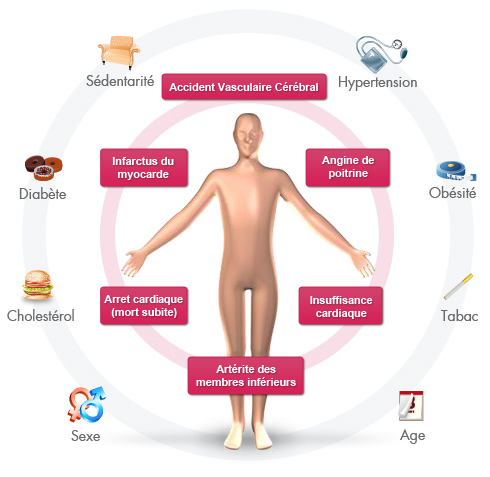

```{r setup, include=FALSE}
knitr::opts_chunk$set(echo = FALSE)
```

As part of my English course, I have to do a blog throughout the year.
I will introduce you in a few words the subject of my blog. It is entitled “heart disease and problems”.

 

Why did I choose the heart as my main topic?


First of all, it’s one of our most important organs playing one of the most essential roles in the body. This vital organ works like a pump. This pump function is ensured by the two ventricles. By contracting, these ensure the ejection of blood into the arteries. This blood allows the oxygenation of the whole body. 
Without this heart, the organs would not be able to function, which can cause major problems and even death. 

Then the normal heart rate is 80 beats per minute. But this can be adapted by a system, called the autonomic system, according to the needs of the organism. 
If this rate is too high or too low, this can cause serious problems. Therefore, it’s important to keep an eye on it. 

Why does this topic interest me?

It’s a subject I wanted to explore further simply because I find it very interesting. I wanted to know where heart problems come from and what they are caused by.
So, I did some research on different websites. Then I found some articles that interested. I did their analysis. 
For this purpose, I used site such as linguee, reverso and deepl for definition or to find synonyms. 


